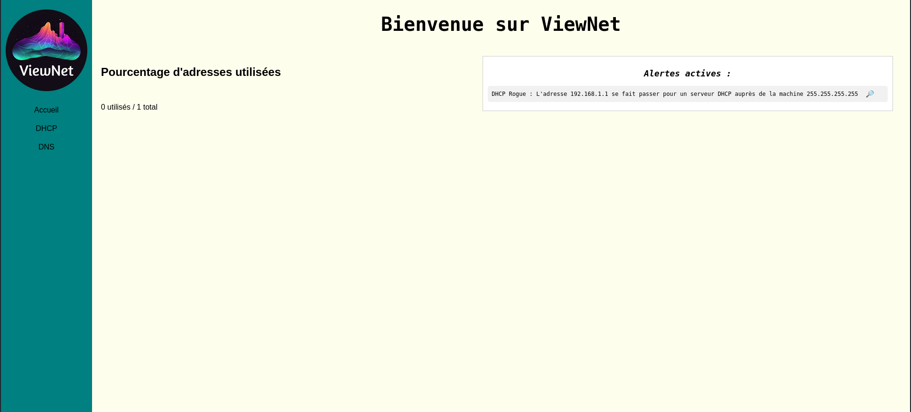
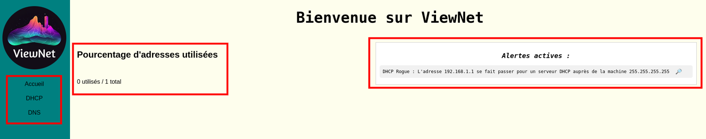
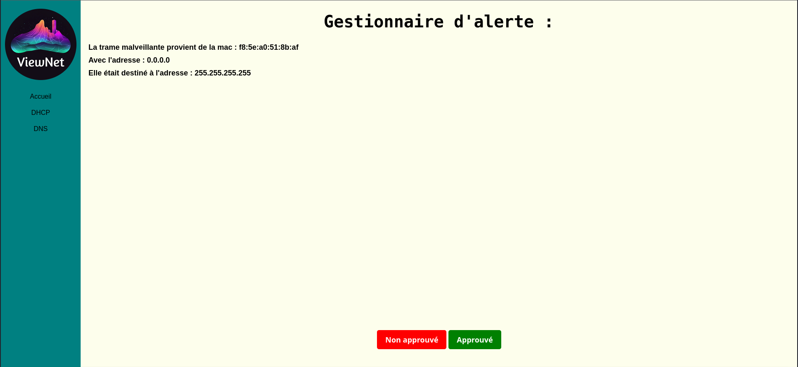
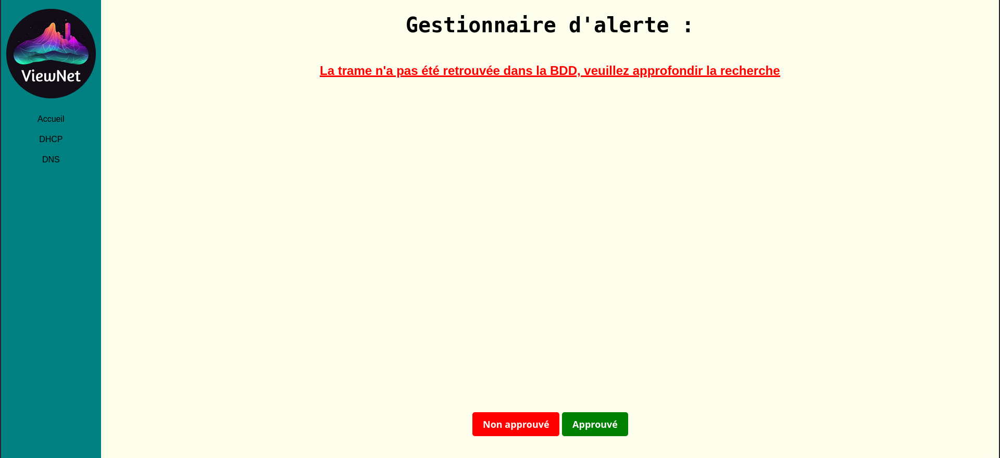
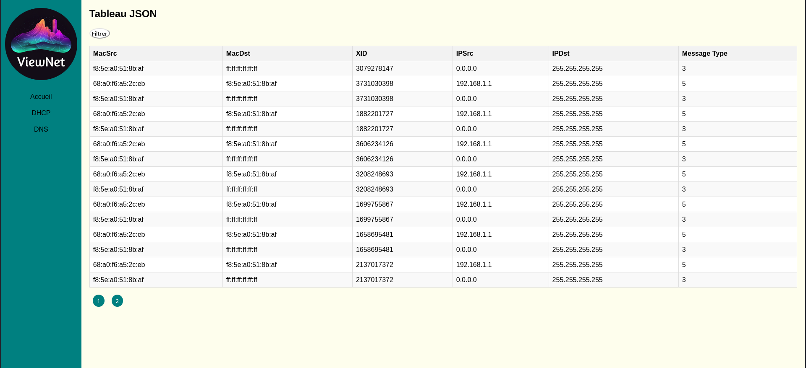

# <b> <u> ViewNet - Votre outil de supervision </b> </u>

## 1 - Accueil 

Lorsque vous arrivez sur le site, ce sera la premmière page que vous voyez.

Elle se divise en 3 parties :

De gauche à droite nous avons :
- Un menu qui permet de naviguer entre les différentes fonctionnalités du site
- Un barre d'état sur le nombre d'addresse utlisées par rapport au nombre d'adresses totales (pool dhcp)
- Une liste de toutes les adresses actives sur votre réseau.

## 1.1 Alertes
Lorsque l'on clique sur la première alerte que l'on voit ci-dessus on nous renvoie sur cette page :

Sur laquelle nous pouvons voir des informations utiles à la résolution de cette dernière. On a vu au préalable que cette requête était de type DHCP Rogue il est donc important d'avoir ces informations.

Une fois que l'alerte a été prise en compte il est possible de l'approuvé, elle ne sera donc plus marqué en tant qu'alerte active sur la page d'accueil et passera en statut approuvé sur la base de données. 

<i>Nota bene :  Il est tout a fait possible de ne pas approuvé l'alerte directement afin de s'y pencher dessus plus tard </i>

Nous avons anticipé le cas où l'alerte ait été crée mais la trame n'existe plus :

Si vous ne l'êtes pas veuillez vous référez à l'administrateur réseau de votre infrastrucutre, car il n'est pas normal que la trame ne soit pas retrouvé alors que l'alerte a été créée (possibilité de dissimulation de preuves).

## 2 - Tableau

Afin d'avoir une vue plus utilisable que le format Json nous avons mis en place des tableaux pour les service DNS et DHCP :
 

Ils regroupent l'ensemble des trames au préalable analysées par la sonde. Ils permettent de suivre des échanges en filtrant avec différents paramètres :

Par exemple, cela peut aider pour la résolution d'alerte, on peut voir les activités de la machine malveillante avant qu'elle ait commit cette alerte pour mieux comprendre l'incident.