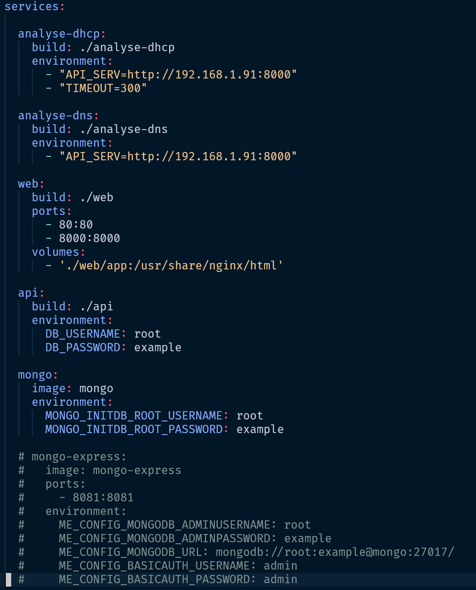
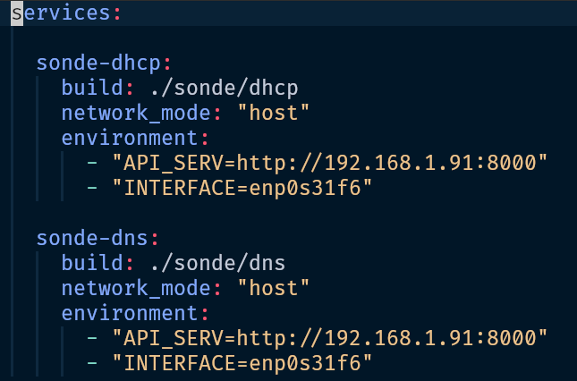
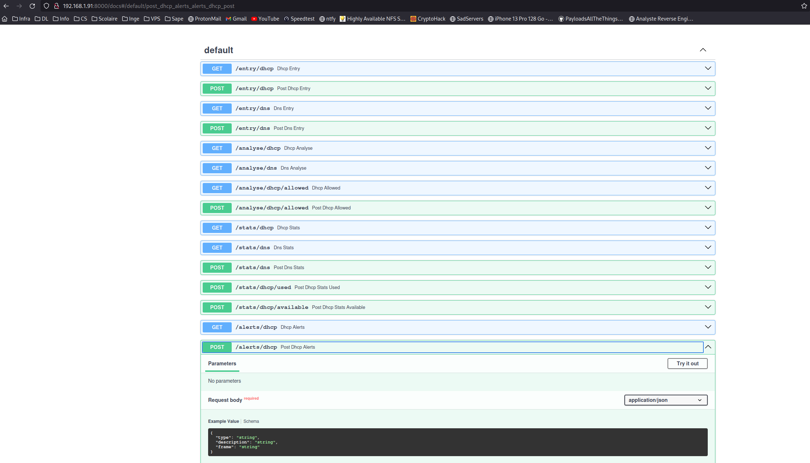

## Installation
Dans l'ordre il faut d'abord mettre en place l'infrastructure puis les sondes

### Infrastructure

Il suffit de cloner le repository Github et les seuls paramètres à faire sont dans le fichier [interface_docker-compose.yml](../src/interface_docker-compose.yml) :



Il faut changer les variables d'environnements qui définissent le mot de passe de la base de données et qu'il soit le même pour **MONGO_INITDB_ROOT_PASSWORD** et **DB_PASSWORD**.
Ensuite il faut changer les variables **API_SERV** avec l'adresse IP qui sera défini pour le serveur d'infrastructure.

Enfin si vous souhaitez avoir un accès visuel à la base de données mongodb vous pouvez utiliser mongo-express en enlevant les commentaires de son service et en le configurant à votre guise.

Pour le démarrer il faut taper ces commandes :
```
docker compose -f interface_docker-compose.yml pull
```
```
docker compose -f interface_docker-compose.yml build
```
```
docker compose -f interface_docker-compose.yml up -d
```

### Sondes

Pour les sondes il suffit de cloner le repository Github et de changer la variable d'environnement **API_SERV** ainsi que l'**INTERFACE** d'écoute de la sonde sur l'host dans le fichier [sondes_docker-compose.yml](../src/sondes_docker-compose.yml) :



Pour les démarrer il faut taper ces commandes :
```
docker compose -f sondes_docker-compose.yml pull
```
```
docker compose -f sondes_docker-compose.yml build
```
```
docker compose -f sondes_docker-compose.yml up -d
```

## Développement
### API
Une documentation de l'API est disponible une fois le serveur d'infrastructure en place. Elle est accessible à l'adresse http://\<IP\>:8000/docs :



Cette page regroupe tout les endpoints disponibles avec leur type de requête et la structure de donnée qu'ils prennent en entrée ou renvoient.

Elle permet aussi de tester interactivement des requêtes ou d'avoir les commandes spécifiques avec la bonne structure.

### Nouvelles alertes
Configurer de nouvelles alertes est très simple pour un développeur débrouillard grâce à la fragmentation du projet. Il faut éditer les fichiers "app/app.py" du moteur d'analyse souhaité afin de rajouter dans la boucle finale qui traite les informations le test souhaité qui retourne les données sur l'endpoint d'API vu dans la documentation précédente. 

### Liste noir de TLD et de nom de domaines

Ces listes là son des listes textuelles qui se trouves à ces emplacements :
- [TLD](../src/analyse-dns/app/bad-tld.txt)
- [Domaines](../src/analyse-dns/app/bad_domains.txt)

Il suffit de les modifier et de redémarrer le moteur d'analyse avec ces commandes :
```
docker compose -f sondes_docker-compose.yml down
```
```
docker compose -f sondes_docker-compose.yml build
```
```
docker compose -f sondes_docker-compose.yml up -d
```